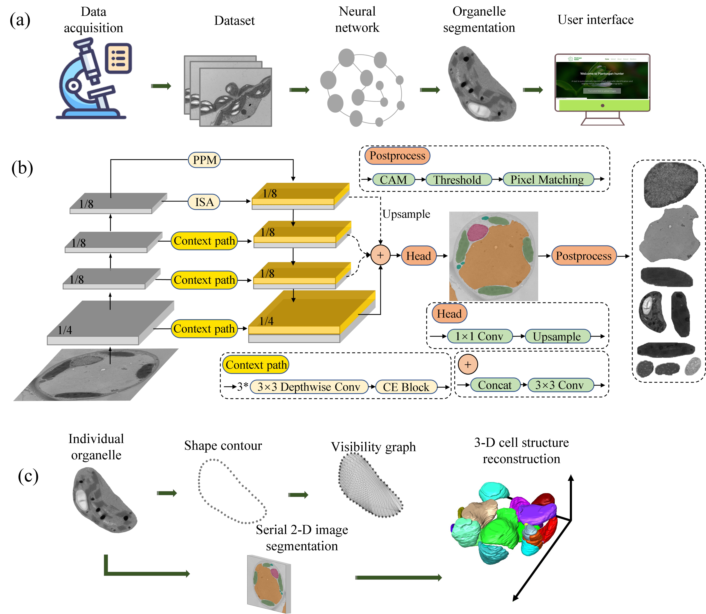

# Welcome to OrgSegNet!
This is an open source project dedicated to the segmentation and 3D reconstruction of plant organelles.

</br>

# Table of Contents

- [Introduction](#introduction)
- [Installation instructions](#installation)
- [Usage instructions](#usage)
- [Acknowledgements](#acknowledgements)
- [Pretrained checkpoint](#pretrained)
- [License](#license)


</br>

# <div id ='introduction'> Introduction </div>
## What is OrgSegNet ?


This a deep learning pipeline, called the organelle segmentation network (OrgSegNet), for pixel-wise segmentation to identify chloroplasts, mitochondria, nuclei, and vacuoles. With the help of OrgSegNet, you can complete a 3D reconstruction of a plant cell very quickly.


</br>

# <div id ='installation'> Installation instructions</div>
## Now let us get started.
First, you need to complete the environment construction and dataset construction first.
Please refer to [Prepare Environment.md](markdowns/PrepareEnvironment.md#installation) for installation and [PrepareData.md](markdowns/PrepareData.md#installation) for dataset preparation.

</br>

# <div id ='usage'> Usage instructions </div>
## Train OrgSegNet on official or fine-tuning dataset
Great, I believe you have completed the environment setup and dataset build.
Now let's train on the official dataset

We provide a training demo on jupyter notebook [Train_OrgSegNet_demo](./demo/Train_OrgSegNet_demo.ipynb), and a fine-tuning demo [Fine-tune_OrgSegNet_demo](./demo/Fine-tune_OrgSegNet_demo.ipynb), other demos can be found in file root "demo".

## Read these to get more informations:
- [System and Hardware requirements](markdowns/Systemrequirements.md)
- [Test the dataset using the trained model(checkpoint)](markdowns/TestData.md)
- [Instance generation based class activation map (CAM)](markdowns/GenerateCAM.md)
- [Web implementation](markdowns/TestData.md)
- [OrgSegNet code architecture and related guides](markdowns/Architecture.md)

## <div id ='pretrained'> Pretrained checkpoint </div>


The pretrained checkpoint can be downloaded from the [google drive link](https://drive.google.com/file/d/12TYv8mEUWdVqjrfbrKZK_OtcV5pq6ejr/view?usp=drive_link), 
or run this code below:
```
!mkdir ../checkpoints
!wget https://drive.google.com/file/d/12TYv8mEUWdVqjrfbrKZK_OtcV5pq6ejr/view?usp=drive_link -P ../checkpoints

```

<b>As the official data set increases, the pre-trained model will be iterated gradually</b>.


</br>

# <div id ='acknowledgements'> Acknowledgements. </div>


OrgSegNet is built on the [MMCV](https://github.com/open-mmlab/mmcv.git) and [MMSegMentation](https://github.com/open-mmlab/mmsegmentation.git) open source frameworks. OrgSegNet was developed and maintained by Zeyu Yu, Institute of Agricultural Information Technology, School of Biosystems Engineering and Food Science, Zhejiang University.

</br>

# <div id ='license'> License. </div>
Please cite the following paper when using OrgSegNet:
```
Xuping Feng, Zeyu Yu, Hui Fang et al. Plantorgan hunter: a deep learning-based framework for quantitative profiling plant subcellular morphology, 12 July 2022, PREPRINT (Version 1) available at Research Square [https://doi.org/10.21203/rs.3.rs-1811819/v1]
```
Citation information will be updated after the paper is published.